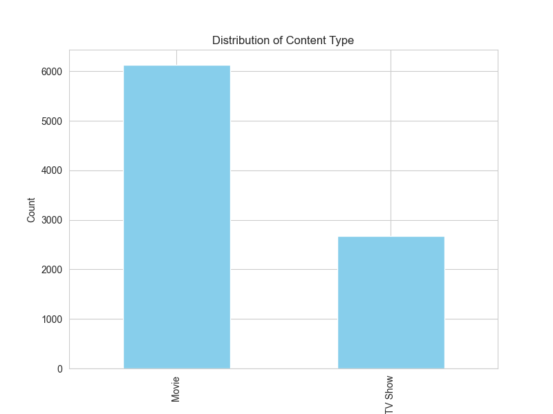
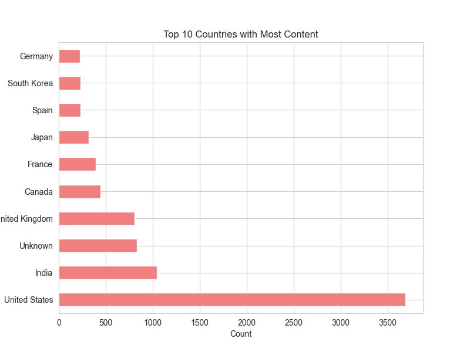
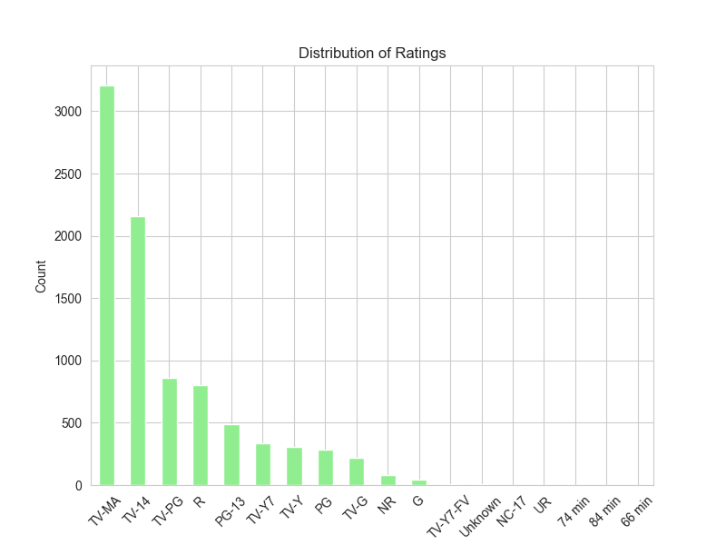
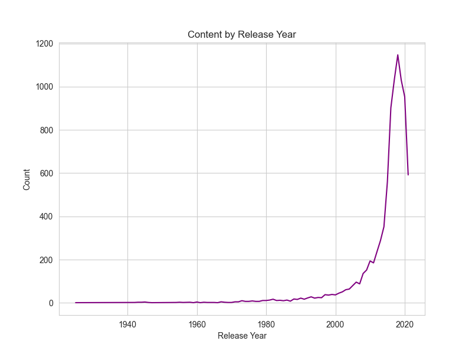
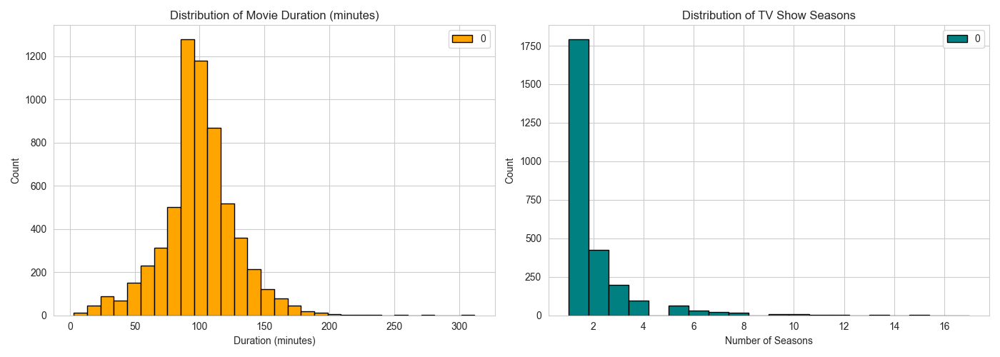
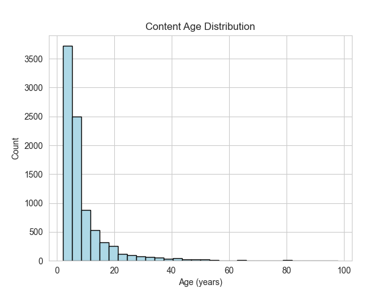

# Netflix Data Analysis and Dashboard


A comprehensive data analysis project exploring Netflix's content library using Python. This project includes exploratory data analysis (EDA), data visualizations, a movie recommendation system, and an interactive web dashboard built with Dash.

## 📊 Project Overview

This project analyzes the Netflix dataset (`netflix_titles.csv`) to uncover insights about content distribution, trends, and patterns. The analysis covers content types, geographical distribution, ratings, release years, and more. Additionally, it features a content-based recommendation system and an interactive dashboard for dynamic exploration.

## ✨ Features

### 🔍 Exploratory Data Analysis (EDA)
- **Data Cleaning**: Handling missing values and standardizing data formats
- **Content Distribution**: Analysis of Movies vs. TV Shows
- **Geographical Insights**: Top countries producing content
- **Rating Analysis**: Distribution of content ratings
- **Temporal Trends**: Content release patterns over time
- **Duration Analysis**: Movie lengths and TV show seasons

### 📈 Visualizations
- Bar charts for content type and rating distributions
- Horizontal bar charts for top countries
- Line plots for release year trends
- Histograms for duration distributions
- Age distribution of content

#### Key Visualizations







### 🤖 Movie Recommendation System
- Content-based filtering using TF-IDF vectorization
- Cosine similarity for finding similar movies
- Recommendations based on genres and descriptions

### 🖥️ Interactive Dashboard
- Built with Dash and Plotly
- Real-time filtering by content type and rating
- Multiple interactive charts:
  - Content type distribution
  - Top countries chart
  - Release year trends
  - Rating distribution
  - Movie duration histogram
- Responsive design with Netflix-inspired styling

## 🛠️ Installation

### Prerequisites
- Python 3.7+
- Jupyter Notebook
- Web browser for dashboard

### Dependencies
Install the required packages using pip:

```bash
pip install pandas numpy matplotlib seaborn scikit-learn dash plotly
```

Or install from requirements.txt (if available):

```bash
pip install -r requirements.txt
```

## 🚀 Usage

### Running the Jupyter Notebook
1. Clone or download the project files
2. Ensure `netflix_titles.csv` is in the same directory as `movies.ipynb`
3. Open the notebook in Jupyter:

```bash
jupyter notebook movies.ipynb
```

4. Run all cells to perform the analysis and generate visualizations

### Using the Recommendation System
In the notebook, use the `recommend_movies()` function:

```python
recommend_movies('Inception', n_recommendations=5)
```

This will output similar movies based on content similarity.

### Running the Interactive Dashboard
1. In the notebook, run the Dash app cell
2. The dashboard will start on `http://127.0.0.1:8050/` (or similar)
3. Open the URL in your web browser
4. Use the dropdown filters to explore different views of the data

## 📁 Project Structure

```
├── movies.ipynb              # Main Jupyter notebook with analysis and dashboard
├── netflix_titles.csv        # Netflix dataset (not included in repo)
├── README.md                 # Project documentation

```


